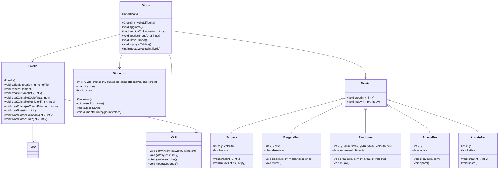

# 🚀 Gioco Console in C++ (Versione Ottimizzata)

## 📖 Descrizione  
Questo progetto è un **gioco a caratteri in C++** che utilizza la console per la visualizzazione. Il giocatore può muoversi in un labirinto, raccogliere oggetti, combattere nemici e affrontare un boss finale.  

### **⚙️ Caratteristiche principali**
- **Movimento del giocatore** tramite `W, A, S, D`
- **Sparatoria** con il tasto `M`
- **Checkpoint e reset** con il tasto `R`
- **Tre livelli di difficoltà**: Facile, Medio, Difficile
- **Nemici con IA**: inseguitori, pattugliatori, e torrette
- **Boss finale con punto debole**
- **Sistema di punteggio**
- **Opzione per resettare il gioco**
- **Mappa caricata da file esterni** (`level_X.txt`)

---

## 🗂 **Struttura dei file**
Il codice è suddiviso nei seguenti file per una migliore organizzazione:

| **File**          | **Descrizione** |
|------------------|---------------|
| `main.cpp`       | Gestisce il menu e avvia il gioco |
| `Gioco.h/cpp`    | Logica di gioco e gestione degli eventi |
| `Livello.h/cpp`  | Caricamento della mappa e gestione del boss |
| `Giocatore.h/cpp`| Movimenti e stato del giocatore |
| `Nemici.h/cpp`   | Implementazione dell'IA dei nemici |
| `Utils.h/cpp`    | Funzioni di supporto (console, legenda, ecc.) |

---

## 🖼 **Diagramma UML delle classi**  


> **Spiegazione:**  
> - `Gioco` gestisce l'intero flusso del gioco.  
> - `Livello` carica e gestisce la mappa.  
> - `Giocatore` controlla il movimento e lo stato del giocatore.  
> - `Nemici` include vari tipi di nemici con IA.  
> - `Utils` contiene funzioni di supporto per la console.  

---

## 📝 **Funzioni e loro posizione nei file**
Ecco l'elenco delle principali funzioni, suddivise per file:

### 🔹 **`Gioco.cpp`**
- `aggiorna()` → Esegue il loop di gioco  
- `gestisciInput()` → Gestisce il movimento del giocatore  
- `rilevaDanno()` → Controlla se il giocatore viene colpito  
- `wyczyscTablice()` → Resetta la mappa e ricarica il gioco  
- `impostaVelocita()` → Modifica la velocità in base alla difficoltà  

### 🔹 **`Livello.cpp`**
- `caricaMappa()` → Carica la mappa dal file  
- `generaElementi()` → Genera oggetti e nemici sulla mappa  
- `creaBoss()` → Genera il boss finale  
- `tworzBossaPokonany()` → Mostra l'animazione del boss sconfitto  
- `tworzBossa1Raz()` → Simula l'arrivo del boss  

### 🔹 **`Giocatore.cpp`**
- `resetPosizione()` → Resetta la posizione del giocatore  
- `subisciDanno()` → Riduce le vite del giocatore  
- `aumentaPunteggio()` → Incrementa il punteggio  

### 🔹 **`Nemici.cpp`**
- `Scigacz::muovi()` → Insegue il giocatore  
- `BiegaczPoz::muovi()` → Si muove orizzontalmente  
- `Randomer::muovi()` → Movimento casuale  
- `ArmatePoz::spara()` → Torretta che spara in orizzontale  
- `ArmatePio::spara()` → Torretta che spara in verticale  

### 🔹 **`Utils.cpp`**
- `SetWindow()` → Imposta la finestra della console  
- `gotoxy()` → Posiziona il cursore nella console  
- `getCursorChar()` → Legge il carattere alla posizione del cursore  
- `mostraLegenda()` → Mostra i comandi disponibili  

---

## 🎮 **Controlli di Gioco**
| **Tasto** | **Azione** |
|----------|------------|
| `W` | Muovi in alto |
| `A` | Muovi a sinistra |
| `S` | Muovi in basso |
| `D` | Muovi a destra |
| `M` | Spara |
| `R` | Resetta al checkpoint |
| `ESC` | Esci dal gioco |

---

## 📥 **Installazione ed esecuzione**
### **Requisiti**
- **Compilatore C++** (MinGW, Visual Studio o GCC)
- **Windows** (per compatibilità con la console)
- **File di mappa** (`level_1.txt`, `level_2.txt`, ecc.)

### **Compilazione**
Compila il gioco con il comando:
```sh
g++ main.cpp Gioco.cpp Livello.cpp Giocatore.cpp Nemici.cpp Utils.cpp -o Game.exe -static -mwindows
```

### Esecuzione
```sh
Game.exe
```

## 📜 Possibili miglioramenti
- ✔ Aggiunta di nuovi livelli e mappe
- ✔ Nuovi tipi di nemici con IA più avanzata
- ✔ Sistema di salvataggio del punteggio

## 📌 Autore
Matteo Filippini
